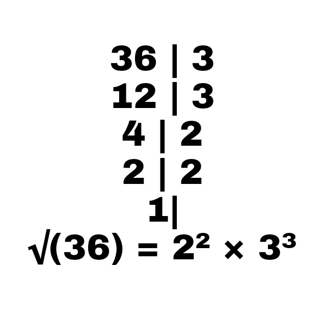

# Fatoracao
Fatorar um número

## Sumário
- [O que é fatoração?](#What)
	- [Exemplo](#Example)
- [Como o codigo faz isso?](#How)
- [Tecnologias envolvidas](#Tecnologies)
- [Autor](#Author)

## O que é fatoração? 
Fatoração é o processo de decompor um número em fatores primos.
Essa decomposição é feita através de divisões por divisores primos. O quociente da divisão anterior se torna o dividendo da divisão atual, e isso se repete até o quociente ser 1.
Após isso, conta-se os divisores primos encontrados. O resultado é um produto/uma potência do valor digitado.
Geralmente é utilizado para encontrar a raiz quadrada.

### Exemplo 

## Como o código faz isso? 
Pra isso, existem duas listas: uma, chamada _PrimeNumbersList_, contém números primos e é utilizada nos cálculos. A outra, _FactorsList_, é utilizada para gerar o resultado.

Segue o algoritmo explicado:
1. O usuário digita um número. Esse número é armazenado como um *dividendo*.
2. Para as repetidas divisões, é utilizado um loop, que só encerrará quando o dividendo for 1 ou um número primo.
3. Dentro do loop, acontece uma verificação: este dividendo é divisível por algum dos números listados em _PrimeNumbersList_? Se sim então...
	- O número encontrado na lista se torna o *divisor* atual
	- O quociente do dividendo é do divisor se torna o dividendo na próxima vez
	- O divisor é adicionado na lista _FactorsList_.
   Caso o dividendo não seja divisível por ninguém listado, entende-se que o mesmo é um número primo e o loop se encerra.
4. Pra exibir o resultado, é analisado todos os números adicionados em _FactorsList_. Números repetidos são anotados em uma lista especial, cuja função é auxiliar na contagem de quantas vezes o número se repete. Isso é utilizado pra montar as potências.
5. O produto dos fatores a.k.a. resultado final é exibido no formato (número^expoente).

## Tecnologias envolvidas 

1. IDE [Java N-IDE](https://play.google.com/store/apps/details?id=com.duy.compiler.javanide)
2. Git

## Autor 

Luigi Moraes

 [Github](https://github.com/luigimoraes)
 [LinkedIn](https://www.linkedin.com/in/santos-luigi-moraes)
