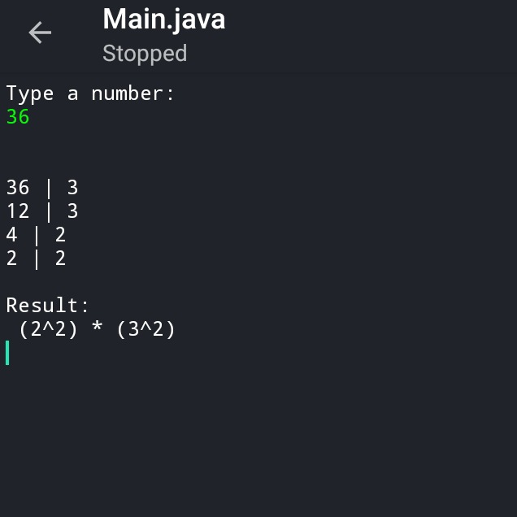

# Fatoracao
Fatorar um número

## Summary
- [O que é Fatoração](#What)
	- [Exemplo](#Example)
- [Como o codigo funciona](#How)
<1-- [Pré-requisitos](#Pre-requisites) -->

## What is 
Fatoração é o processo de decompor um número em fatores primos.
Essa decomposição é feita através de divisões por divisores primos. O quociente da divisão anterior se torna o dividendo da divisão atual, e isso se repete até o quociente ser 1.
Após isso, conta-se os divisores primos encontrados. O resultado é um produto/uma potência do valor digitado.
Geralmente é utilizado para encontrar a raiz quadrada.

### Example 

## How it works 
Para isso, 3 classes foram criadas:
 - Main, que lida diretamente com o usuário recebendo e retornando dados, além de realizar o cálculo em si
 - PrimeNumbersList, que lida com uma lista contendo os números primos que serão utilizados no processo
 - e FactorsList, que cria e manipula uma lista dos números primos utilizados no processo

Usando um loop do-while, a classe Main verifica se o dividendo é divisível por algum dos números existentes em PrimeNumbersList. Caso exista, essa mesma classe vai setar o divisível correspondente, e logo após esse valor se torna o divisor atual. 
Em seguida, 

Built with [Java N-IDE](https://play.google.com/store/apps/details?id=com.duy.compiler.javanide).
